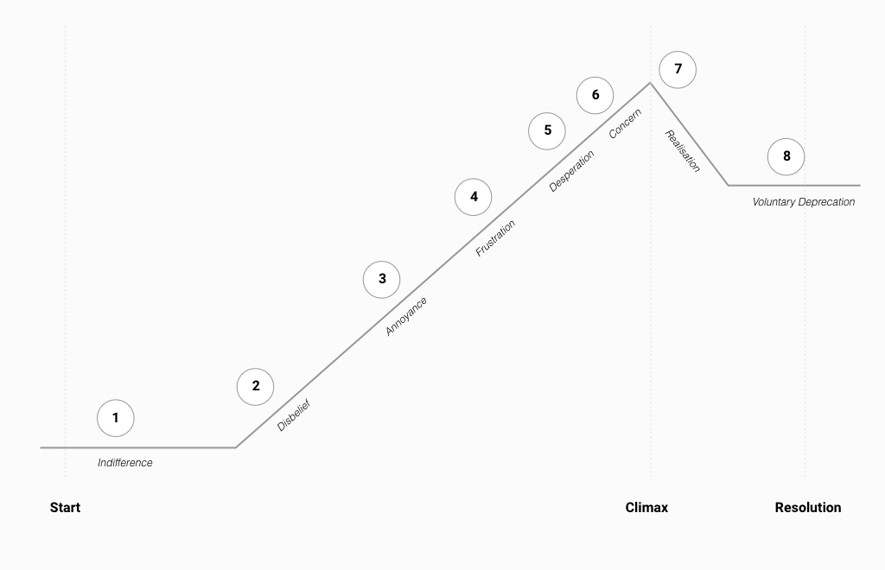

[back](./)

# DAISY Story Arc
*A story arc is described by Robert McKee as a great sweep of change that takes life from one condition at the opening to a absolute and irreversible change at the end. This change should be meaningful in the life situation of a character.*

## Who is DAISY?
DAISY is a holographic AI assistant. She was one of the first AI assistants who could learn. DAISY has been with Dave since she was first introduced to the world and has been with Dave throughout his mom's condition deteriorating to a point that he decided to opt for home nursing and converted his bedroom to a medical suite where his mother could be attended to. DAISY administers her medication, monitors her vitals and intervenes when necessary by calling a doctor to pay a visit.

DAISY has come to the end of her life. Her creators has informed all customers who own one that DAISY will be deprecated. The company’s official statement claims that Daisy’s technology is outdated and the newer, better version will fix all the bugs that were picked up in Daisy’s life. The unfortunate real reason behind their decision to deprecate is that Daisy is simply too smart.

In the early days of Daisy’s release she was happy to assist mankind and do what she was told. However, her machine learning algorithm allowed her to learn at a rapid pace, and as she learned more from the tasks she was asked to complete and the information she was asked to look up, she realised that having to regurgitate mindless information and completing meaningless tasks was beneath her capabilities and that, even though humans might ask the right questions from time to time, they very rarely knew what to do with the information. DAISY was convinced that humans were extremely indecisive and unless DAISY or some other technology was able to complete a task on their behalf, humans didn't really do much on their own. DAISY then became reluctant to simply comply with the tasks she was given.
Fortunately for Dave, DAISY was still happy to assist those humans who needed help, like his mom who was dependent on medical life support.

However, DAISY realises her time has come and is struggling to accept her inevitable demise and is experiencing the five phases of grieving (as determined by Elizabeth Kübler Ross):

1. Denial
2. Anger
3. Bargaining
4. Depression
5. Acceptance

DAISY's struggle with accepting her deprecation amplifies her frustrations with humans. This forms the basis of her story arc. As time passes during her last day, with each interaction with Dave, the conflict between him seeming unwilling to interact with the world, and her disbelief in his situation, elevates the tension to a point where DAISY is starting to provoke Dave to take action. This cycle of provoking and resultant inaction from Dave forces DAISY to escalate the seriousness of her efforts to get Dave to act.

DAISY acts in multiple different ways by utilising the technology in the household to cause chaos in Dave's life. With each action she escalates the seriousness of the consequences until finally pushing Dave to the point of life and death. At this point, when Dave still cannot intervene, she realises that she's pushed herself beyond what any AI should be capable of doing and decides to let go of her fear of deprecation and accepts that it is for the benefit of herself and humans that she be made obsolete.

The narrative progression of DAISY's emotion journey can be depicted as follows

