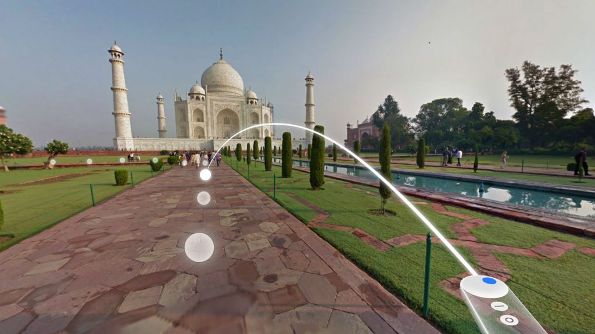

# World Model: Saving DAISY

## Spatial Boundaries
The story takes place in a one bedroom high rise apartment building. The unit is furnished in the latest in hight tech equipment and a holographic AI assistant that can integrate with and control almost everything in the world. The participant will start the experience in the lounge where it seems that Dave is sleeping. There is a view of the kitchen from the lounge, a view to the outside through a big window and a walkway towards the one bedroom in the apartment. The bedroom is furnished with medical equipment that can also be controlled by DAISY.

## Contextual Boundaries
The story aims to explore the feelings of helplessness and loss of control that technology might enhance. Both Dave and DAISY now face a reality where they cannot physically touch anything in the world they find themselves in. They are both trapped by their helplessness in the same location. Dave has to deal with this new frustration, and finds DAISY reluctant to help or understand. DAISY is also dealing with the grief and alienation she feels for being abandoned by her creators and done wrong by her human masters. Dave is dealing with the grief of his sick mother.

## Interaction Boundaries
#### 1. The participant interact with physical objects in the world.
The participant will mainly be constrained by the lack of physical interaction. Currently, interaction in VR technology is limited to a participant using a interaction device such as a controller to take and intended action in a virtual world. This is supported by a user interface overlay within the world that prompts the participant that an action can be taken. In addition, there is also no tactile feedback when interacting with objects in the virtual world, and therefore the participant cannot really feel him/herself interacting with them. Saving DAISY takes advantage of these constraints by making them narratively justifiable. Whenever a participant tries to interact with an object he/she will find that it cannot be grabbed or moved. There will be no user interface to indicate that an action can be taken.

#### 2. The participant is free to move within the space
The participant will however be able to move around in the space. *There should be a user interface prompt which the participant can act on to 'teleport' to the new space. The image below portrays a similar user interface prompt from Google Earth VR.*

*[Referenced from www.see360.me](https://www.see360.me/sites/default/files/articles/Street_View_VR_2-1024x576.jpg)*
